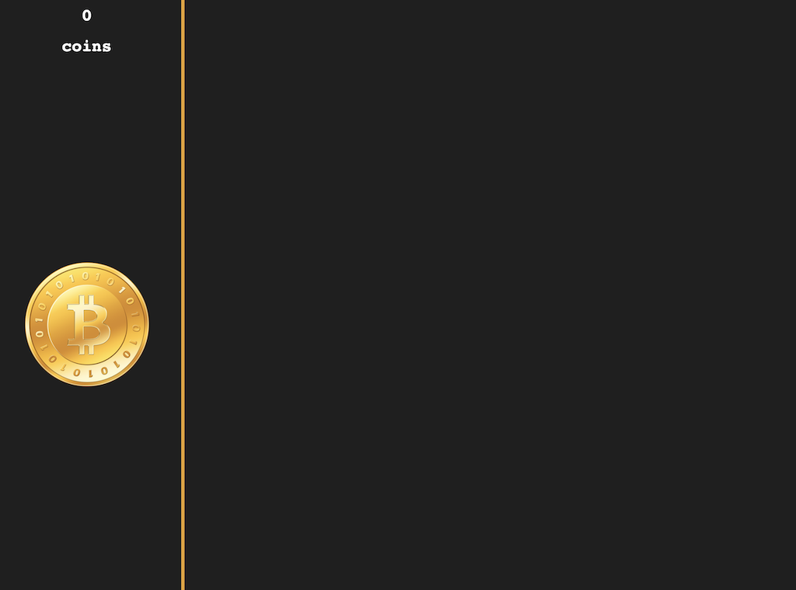

# Instructions

Fork this repository and start

## Rubrics

Core functionality

- Button to get coins
  - 1 click gives equivalent of total cps (coins per second) or +1 if cps is 0 (when no resources have been bought)
- Resources implemented
  - Can buy resources which updates cps (coins per second)
- Coins counter updates automatically (every 10ms)

Additional functionality

- Achievements
- Bonus coins
- Coin popup message on click (text showing number of coins gained)

Presentation

- Layout matches screenshots
- Resource box appears when max coins >= cost / 2. Can only be clicked when player has enough coins
- Purchased resources (assets) appear in the middle
- Sounds
  - Coin sound when clicking
  - Buying sound when puchasing a resource

Note: This is meant to be played on desktop, no need to worry about being mobile responsive although it would of course be taken into account if done

Presentation - Extra

- Animation for achievement box (slide in animation), coin click (scale effect)
- Coin background change based on cps (coins per second)
- Format text for coins counter when > 1 million coins and > 1 billion coins

Functionality - Extra

- Local storage to save progress

## Game rules

## Coins

A coin click instantly gives the total amount of cps (coins per second) generated by all assets owned.  
Example: 2 miners owned = 2 \* 1cps = 2cps total. Each coin click gives 2 coins instanstly.  
A coin click shows a popup text with at the position of the mouse the number of coins earned (e.g. +2 in this example).

The number of coins is updated every 10ms. This depends on the assets owned and their cps value (coins generated every second).

Over 1 million coins, coins should read 1.XX million  
Over 1 billion coins, coins should read 1.XX billion

The background gets updated to the gif following these rules:

- cps (coins per second) > 1000000 -> fallingcoins2.gif
- cps (coins per second) > 100000 -> fallingcoins1.gif
- cps (coins per second) > 1000 -> fallingcoins0.gif

### Resources

Each resource is an object with the following properties:

- name (string)
- owned (number)
- cps (number - coins per second)
- cost (number)
- img (string - img src)

These are the following resources to implement:

- name: 'Miner'
- cps: 1
- cost: 50

* name: 'Computer'
* cps: 10
* cost: 500

- name: 'Data center'
- cps: 100
- cost: 2000

* name: 'Super computer'
* cps: 1000
* cost: 500000

- name: 'Quantum computer'
- cps: 10000
- cost: 200000

* name: 'AI'
* cps: 100000
* cost: 5000000

- name: 'Matrioshka brain'
- cps: 1000000
- cost: 20000000

* name: 'Simulation'
* cps: 0
* cost: 1000000000

The simulation resource is not an actual resource to gain coins, it clears the local storage and restarts the game (only restarts game if local storage is not used).

A resource is not visible until max amount of coins so far >= cost of resource / 2

Resource can not be purchased if cost of resource > coins. This is reflected visually with lower opacity and no click events (`pointer-events: none;`)

### Assets

Assets are resources the player has bought. They appear in the middle section of the game.

There is no limit to how many assets can be purchased, but there is a limit of 20 images that can be added to the DOM per asset type (e.g. miner, computer)

### Achievements

Each achievement is an object with the following properties:

- message (string)
- isComplete (function)
- seen (boolean)

These are the following achievements to implement:

- message: 'Entrepreneur'
- condition to complete: >= 5 miners owned

* message: 'From rags to riches'
* condition to complete: max coins >= 1000 (maximum number of coins user ever had since the start)

- message: 'Click madness'
- condition to complete: total clicks >= 100 (total number of times user clicked)

* message: 'Money rocket'
* condition to complete: total coins per second >= 10000

- message: 'Singularity'
- condition to complete: AI owned >= 1

* message: 'Ready for simulation'
* condition to complete: max coins >= Simulation cost

## Bonus coins

Every 40s, starts a timeout to create a bonus coin.
A bonus coin is created after a random timeout between 0 and 60s.

A bonus coin can appear anywhere on the screen, lasts for 10s before disappearing.  
If the user clicks the coin before the timeout is over, user receives between 2 to 10 times (random range) the total coins per second.  
Example: 2 miners -> 2cps -> bonus can give 2\*2 = 4 up to 2\*10 = 20 coins

## Local storage

Save the game state every 10 seconds. Cleared when simulation is bought.

## Reference

Font family used is monospace (you can use a different font if you prefer).

Here are a few different functions and properties you may want to keep in mind when working on the project:

**CSS**  
pointer-events

**JS**  
_DOM functions and properties_  
document.querySelector  
document.getElementById  
document.getElementsByClassName  
document.createElement  
appendChild and removeChild  
addEventListener  
innerHTML  
className  
classList

_Utility functions_  
toFixed (useful to format numbers)  
Math.max and Math.min  
setTimeout  
setInterval  
Date.now()

_Mouse position (ev = event objectxf)_  
ev.clientX  
ev.clientY
